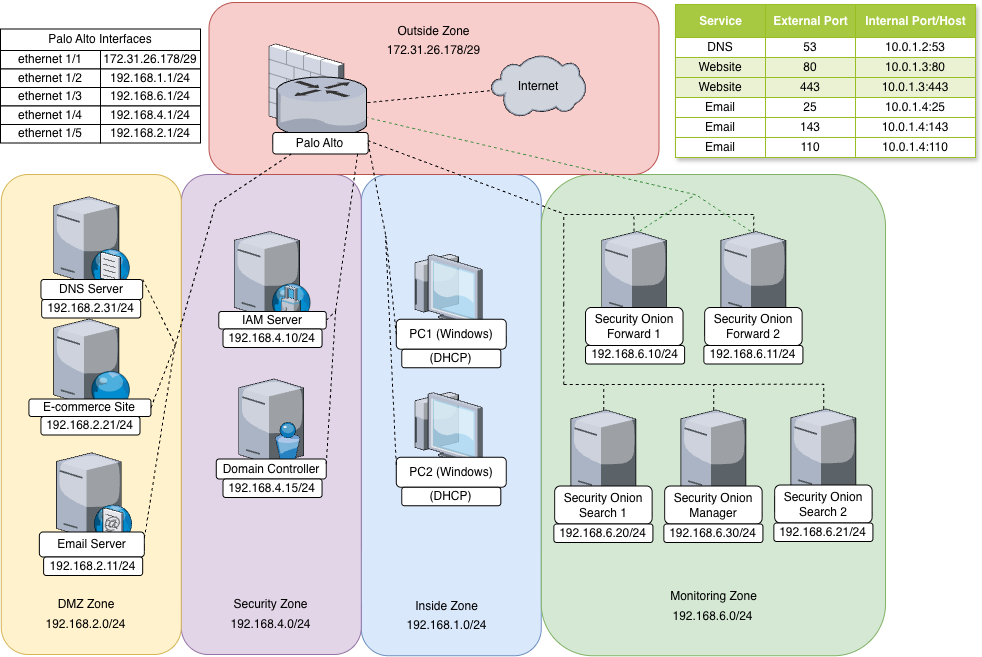

# ZenShop

A secure e-commerce platform built for Security Design class project.

## About

ZenShop is a full-stack e-commerce application with focus on security best practices. It features product browsing, cart management, and checkout flow (no real payment processing).

## Architecture

- **Frontend**: React + Vite, TypeScript, TailwindCSS
- **Backend**: Node.js, Express, Prisma ORM
- **Database**: PostgreSQL
- **Auth**: Keycloak (OIDC)
- **Infrastructure**: Docker containers, Nginx, ModSecurity WAF

### Network Architecture



The diagram above illustrates the network zones and security boundaries of the ZenShop deployment.

## Features

- Public product catalog
- User authentication & authorization
- Shopping cart & checkout flow
- Admin portal for product management
- Security controls (CSRF, XSS protection, rate limiting, etc.)
- Activity audit logging

## Security Considerations

This application implements security controls aligned with:
- OWASP Top 10 (2021)
- CIS Benchmarks
- Basic PCI-DSS requirements (non-payment sections)

## Development Setup

### Prerequisites

- Node.js 18+
- Docker and docker-compose
- PostgreSQL 15 (or use Docker container)

### Running locally

```bash
# Clone repository
git clone https://github.com/jbhuiyan-matc/ZenShop.git
cd ZenShop

# Install dependencies for frontend and backend
cd frontend && npm install
cd ../backend && npm install

# Set up development environment
docker-compose up -d
```

## Deployment

### Prerequisites

- A server with Docker and Docker Compose installed
- Domain name (optional for production deployment)
- SSL certificates (or use Let's Encrypt)

### Production Deployment Steps

1. Clone the repository on your production server:
   ```bash
   git clone https://github.com/jbhuiyan-matc/ZenShop.git
   cd ZenShop
   ```

2. Create a production environment file:
   ```bash
   cp .env.example .env
   # Edit .env with your production settings
   nano .env
   ```

3. Add SSL certificates:
   ```bash
   mkdir -p infra/nginx/ssl
   # Add your SSL certificates to this directory
   # fullchain.pem and privkey.pem
   ```

4. Run the deployment script:
   ```bash
   ./deploy.sh
   ```

5. Configure your firewall according to the network architecture diagram

### Deployment Files

- `docker-compose.prod.yml`: Production container configuration
- `deploy.sh`: Deployment automation script
- `infra/nginx/nginx.prod.conf`: Production-ready Nginx configuration with security headers

## Project Structure

```
/
├── frontend/           # React + Vite application
├── backend/            # Node.js Express API
├── infra/              # Docker, Nginx configs, deployment scripts
└── docs/               # Documentation, ERD, threat model
```

## License

MIT
