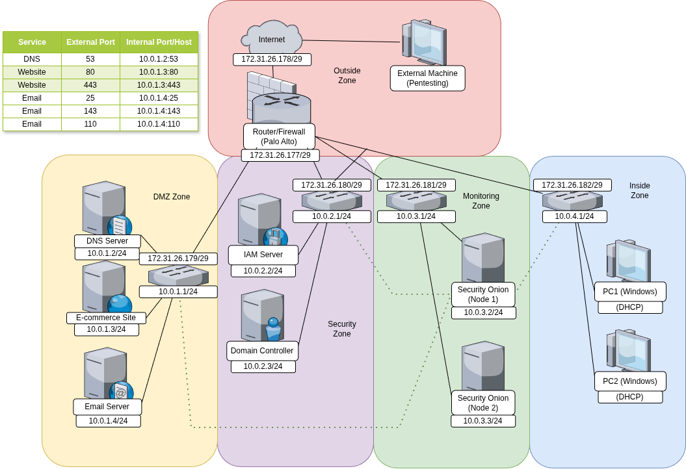

# ZenShop

**A Secure E-Commerce Platform**
*Built for the Security Design Class Project*


**Live Demo:** [https://zenshop-production.up.railway.app](https://zenshop-production.up.railway.app)

## About

ZenShop is a full-stack e-commerce application designed with a security-first approach. It demonstrates secure coding practices and robust application design.

The platform features:
- Product browsing and search
- Shopping cart and checkout simulation
- Secure authentication and authorization
- Admin portal for inventory management

## Tech Stack

| Component | Technology | Description |
|-----------|------------|-------------|
| **Frontend** | React | UI built with TailwindCSS. |
| **Backend** | Node.js, Express | RESTful API with security middleware. |
| **Database** | PostgreSQL + Prisma | Managed on Railway or locally via Docker. |
| **Caching** | Redis | In-memory caching for improved performance. |
| **Infrastructure**| Docker | Containerized deployment via Docker Compose. |

## Features

### User Experience
- **Intuitive Interface**: Clean and responsive design.
- **Product Catalog**: View products with detailed descriptions and images.
- **Shopping Cart**: Real-time cart management.
  
### Security & Administration
- **Role-Based Access Control (RBAC)**: Distinct permissions for Customers vs. Admins.
- **Security Controls**:
    - CSRF & XSS Protection
    - Rate Limiting to prevent abuse
    - Secure Headers (Helmet)
- **Audit Logging**: Comprehensive tracking of sensitive actions.

## Local Development

### Prerequisites
- Node.js 18+
- PostgreSQL (local instance or cloud)
- Docker and Docker Compose (Optional, for containerized setup)

### Setup

1.  **Clone the Repository**
    ```bash
    git clone git@github.com:jbhuiyan-matc/ZenShop.git
    # Or via HTTPS: git clone https://github.com/jbhuiyan-matc/ZenShop.git
    cd ZenShop
    ```

### Run with Docker (Recommended)

The easiest way to get the entire stack (Database, Redis, and Backend) running locally is using Docker Compose.

1. **Start the services**
   ```bash
   docker-compose up -d
   ```
   This will start PostgreSQL, Redis, and the Node.js backend API on `http://localhost:5000`.

2. **Run the Frontend** (in a separate terminal)
   ```bash
   cd frontend
   npm install
   npm run dev
   ```
   The frontend will be available at `http://localhost:3000`.

*Note: For more advanced Docker configurations and resilience testing, refer to the [DOCKER_RESILIENCE_GUIDE.md](./DOCKER_RESILIENCE_GUIDE.md).*

### Run with NPM (Standard)

If you prefer to run everything manually without Docker, follow these steps:

1.  **Install & Run Backend**
    ```bash
    cd backend
    npm install
    
    # Ensure your local PostgreSQL and Redis are running, then set up the DB
    npx prisma generate
    npx prisma migrate dev
    npm run seed
    
    # Start the server
    npm run dev
    ```

2.  **Install & Run Frontend** (in a separate terminal)
    ```bash
    cd frontend
    npm install
    npm run dev
    ```

3.  **Access the Application**
    - Frontend: [http://localhost:3000](http://localhost:3000)
    - Backend API: [http://localhost:5000](http://localhost:5000)

## Project Structure

```
/
├── frontend/           # React + Vite application (UI)
├── backend/            # Node.js Express API (Server)
│   └── prisma/         # Database schema & migrations
└── package.json        # Root build config for deployment
```

## Architecture Diagram

Update:


## Security Considerations

This application adheres to industry standards to ensure data integrity and user safety:
- **OWASP Top 10 (2021)** compliance.
- **CIS Benchmarks** for server hardening.
- **PCI-DSS** best practices for data handling (non-payment scope).
